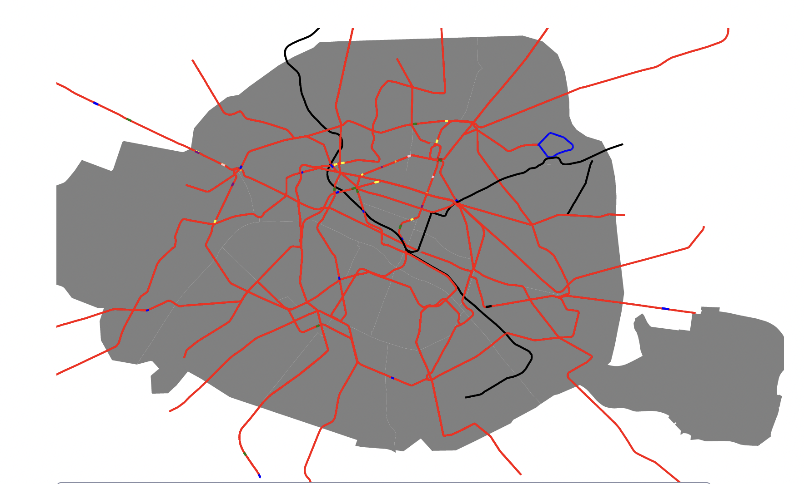

# 2024-03-02

Je commence à écrire la fonction qui va me permettre de relier les stations entre elles. 
Je prends pour exemple : Stalingrad, Jaurès.

Le souci que j'observe, c'est que les stations bien qu'adjacentes ne sont pas à la suite 
dans le tableau des coordonnées des lignes. Entre Jaurès et Stalingrad, il y a 15 points d'écart.
Je suis embêté, je ne sais pas comment je vais faire pour savoir si les stations sont adjacentes entre elles.

Je vais essayer de voir si je peux trouver une solution en regardant les données.
C'est tout à fait normal que les stations ne soient pas adjacentes dans le tableau des coordonnées d'une ligne, 
comme on peut le voir avec mon exemple, où la ligne 2 n'est pas une ligne droite à ce moment-là. 

Je me dis que je peux peut-être ajouter l'information dans les stations de métro de leurs stations adjacentes.
L'idée que j'ai serai de faire un nouveau script dont voici le pseudo code :
```python
- For each line
    - Filter stationInLine in stations
    - For each coordinates in line
        - For each station in stationInLine
            - If coordinates is in station
                - Save station index  
```

Ensuite grâce à ça, j'aurai les index des stations par rapport aux coordonnées de la ligne, 
je pourrai donc chercher les stations adjacentes en prenant les index les plus proches.
À voir si je veux faire un script, pour le calculer à la volée, ou si je veux le stocker dans un fichier.
Je pense le calculer une fois pour toutes, ça évitera d'alourdir les calculs côtés clients.

Le format que je souhaite avoir est le suivant :
```json
{
  "adjacentStations": ["station1", "station2"]
}
```

Est-ce que j'ai besoin de savoir sur quelle ligne sont les stations adjacentes ? 
Je ne crois pas que ça soit utile, mais en même temps pourquoi pas enregistrer l'information comme je l'ai donc avoir un format du type :
```json
{
  "adjacentStations": {
    "2": ["station1", "station2"],
    "3": ["station2"]
  },
  "inLineIndex": {
    "2": 17,
    "7bis": 3
  }
}
```

En écrivant le script, je me rends compte que les multiline string ne me permettent pas de correctement calculer les index des stations.

Je décide de faire une fonction pour les afficher correctement :

```javascript
function printLine(lineName) {
  const line = lines.find((l) => {
    return l.properties.ref === lineName;
  });

  const colors = ['red', 'blue', 'green', 'yellow', 'purple', 'orange', 'pink', 'brown', 'grey', 'black'];

  if (line.geometry.type === 'LineString') {
    svg.append("path")
      .datum(line)
      .attr("d", d3.geoPath()
        .projection(projection)
      )
      .attr("fill", "none")
      .attr("stroke", "black")
      .attr("stroke-width", 2);
  }

  if (line.geometry.type === 'MultiLineString') {
    for (let i = 0; i < line.geometry.coordinates.length; i++) {
      for (let j = 0; j < line.geometry.coordinates[i].length - 1; j++) {
        svg.append('path')
          .attr('d', d3.line()([projection(line.geometry.coordinates[i][j]), projection(line.geometry.coordinates[i][j+1])]))
          .attr('stroke', colors[i % colors.length])
          .attr('stroke-width', 2)
          .attr('fill', 'none');
      }
    }
  }
}
```

Voici le résultat que j'obtiens :



La fonction n'est pas parfaite, elle utilise un `find` au lieu d'un `filter` pour trouver la ligne. 
Cela me permet de voir les multilinestring (en rouge et autres couleurs) et les lignes simples (en noir).
On voit bien que la boucle de la 7 bis n'est pas évidente à faire.
Je vais surement retirer la ligne 7 bis pour le moment, je vais me concentrer sur les lignes simples.
