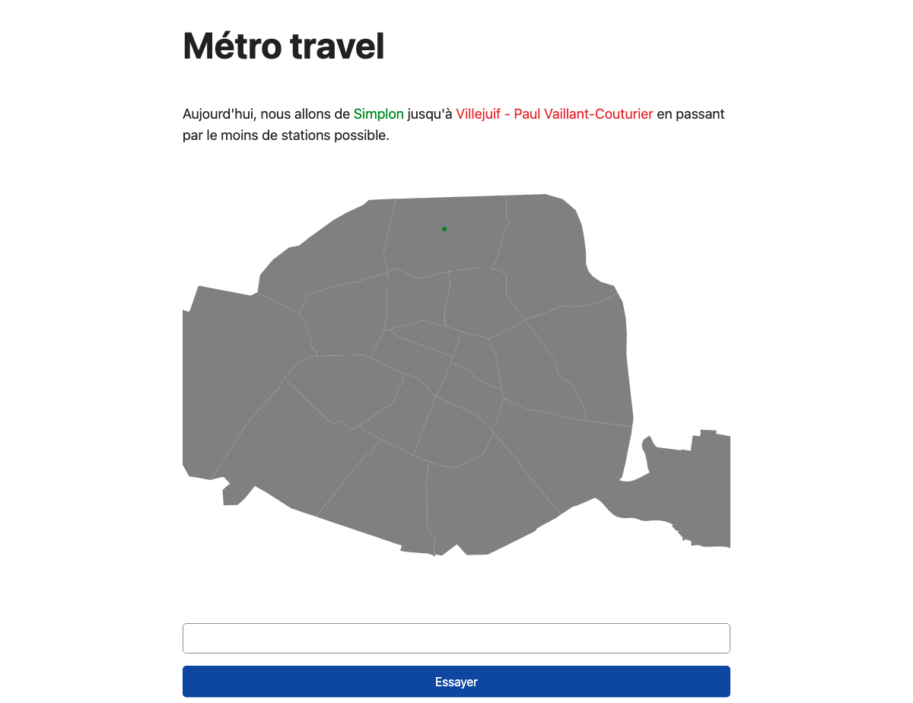

## [1.18.1](https://github.com/VincentHardouin/metro-travel/compare/v1.18.0...v1.18.1) (2024-04-25)

### Bug Fixes

* reduce buttons size ([3010e5c](https://github.com/VincentHardouin/metro-travel/commit/3010e5c01754a1d3239f78c2ad5b7114edcb4b4d))
* start game ([5dfa50b](https://github.com/VincentHardouin/metro-travel/commit/5dfa50b618090feda21af6a818069af4ac41327f))

# [1.18.0](https://github.com/VincentHardouin/metro-travel/compare/v1.17.0...v1.18.0) (2024-04-24)

### Features

* add buttons to zoom in and out ([bdb13dc](https://github.com/VincentHardouin/metro-travel/commit/bdb13dc03b4f393753065f094f950d8d56748bad))

  

# [1.17.0](https://github.com/VincentHardouin/metro-travel/compare/v1.16.0...v1.17.0) (2024-04-23)

### Bug Fixes

* use version in release screenshot commit ([e54b28a](https://github.com/VincentHardouin/metro-travel/commit/e54b28ae2c876dbaa70605779dd5e43027c0b7a1))

### Features

* allow to toggle stop ([7e9a5d9](https://github.com/VincentHardouin/metro-travel/commit/7e9a5d924bb51554008792dbd898c11840c2914e))

  

# [1.16.0](https://github.com/VincentHardouin/metro-travel/compare/v1.15.1...v1.16.0) (2024-04-20)

### Features

* improve extract-data ([38258ec](https://github.com/VincentHardouin/metro-travel/commit/38258ec84ce18c232234ceee1817a64b33476b49))
* use gtfs in front ([69472df](https://github.com/VincentHardouin/metro-travel/commit/69472df8751d30c5c44708970425aa6258a9e86a))
* use new gtfs data for graph ([1a69090](https://github.com/VincentHardouin/metro-travel/commit/1a690909604d57223f4cace410b3dd448d9b8bc6))

  

## [1.15.1](https://github.com/VincentHardouin/metro-travel/compare/v1.15.0...v1.15.1) (2024-04-14)

### Bug Fixes

* add build step in cd workflow ([ce8f9c7](https://github.com/VincentHardouin/metro-travel/commit/ce8f9c7127085cbef40afa364d988e55646f3c92))

# [1.15.0](https://github.com/VincentHardouin/metro-travel/compare/v1.14.0...v1.15.0) (2024-04-14)

### Features

* add extract data script ([1f1f030](https://github.com/VincentHardouin/metro-travel/commit/1f1f03040548c7aefd327c3dbbebc9dbddbc428f))
* add extract data script ([676d4a6](https://github.com/VincentHardouin/metro-travel/commit/676d4a6ac2928cb3901668787442fe689a3d096d))
* add getAdjacentStations with transfers ([da427ab](https://github.com/VincentHardouin/metro-travel/commit/da427abd70e9511a14cc7da3a9a23f14ab2ead35))
* add getAdjacentStations without correspondence ([5bc262e](https://github.com/VincentHardouin/metro-travel/commit/5bc262e81f964bc7ed9b09f4c7d009a6ad520599))
* add import-data script ([b523561](https://github.com/VincentHardouin/metro-travel/commit/b52356119b3be5934442ed39f6c5d49509b2cc20))
* creation migrations ([42cd5be](https://github.com/VincentHardouin/metro-travel/commit/42cd5be9e9aa565ce4672c02d6fc43fe0111ef7f))
* prepare database usage ([85a7d6d](https://github.com/VincentHardouin/metro-travel/commit/85a7d6d3746bea62d0a6a2bdc336c9646ed4ce47))

  

# [1.14.0](https://github.com/VincentHardouin/metro-travel/compare/v1.13.0...v1.14.0) (2024-03-18)

### Features

* remove useless data in lines and stations ([13db2e8](https://github.com/VincentHardouin/metro-travel/commit/13db2e86dacb1bf38bea9072736a7e0454953306))

  

# [1.13.0](https://github.com/VincentHardouin/metro-travel/compare/v1.12.1...v1.13.0) (2024-03-13)

### Features

* show line color ([742908a](https://github.com/VincentHardouin/metro-travel/commit/742908ae1bbade097850df453909bd564420228c))

  

## [1.12.1](https://github.com/VincentHardouin/metro-travel/compare/v1.12.0...v1.12.1) (2024-03-12)

### Bug Fixes

* show final modal ([7168016](https://github.com/VincentHardouin/metro-travel/commit/71680163e410e6594415fe27ba185de5258fcd7f))

# [1.12.0](https://github.com/VincentHardouin/metro-travel/compare/v1.11.0...v1.12.0) (2024-03-11)

### Bug Fixes

* station enter animation ([bdb8d16](https://github.com/VincentHardouin/metro-travel/commit/bdb8d16512024a229afaa29bd5758e5f0507805f))

### Features

* add the shortest path in finish modal ([d9748e5](https://github.com/VincentHardouin/metro-travel/commit/d9748e59e25695fd507105f004f2426670c574b0))

  

# [1.11.0](https://github.com/VincentHardouin/metro-travel/compare/v1.10.0...v1.11.0) (2024-03-11)

### Features

* reduce map height to fit in viewport ([2447ead](https://github.com/VincentHardouin/metro-travel/commit/2447ead0aac0f9560b60e36e2738229ba57be5b2))

  

# [1.10.0](https://github.com/VincentHardouin/metro-travel/compare/v1.9.1...v1.10.0) (2024-03-11)

### Bug Fixes

* handle accent correctly in data export ([970ebc2](https://github.com/VincentHardouin/metro-travel/commit/970ebc20225cfe5e424738eaf2a6b3150d4e714d))
* try button ([9e37ead](https://github.com/VincentHardouin/metro-travel/commit/9e37ead3ac21a55bec7e6481f240e4edb5276267))

### Features

* add feedback after click on try button ([1d7520a](https://github.com/VincentHardouin/metro-travel/commit/1d7520a361d62b76964e7310548872750f15ba5a))
* handle station with same name without accent ([968e4f9](https://github.com/VincentHardouin/metro-travel/commit/968e4f92cad7c3c90986eb739f701a887d397085))
* improve about ([d3dccc5](https://github.com/VincentHardouin/metro-travel/commit/d3dccc585d5a48b85cdd09222282ee13d35840c4))
* remove already added station in search dropdown ([b5af344](https://github.com/VincentHardouin/metro-travel/commit/b5af344ccb5ad4888f7c52e97d1601b1670418d3))
* remove input value after try ([6afaab8](https://github.com/VincentHardouin/metro-travel/commit/6afaab877309d159520d50194aa7f42bb6a17761))

  

## [1.9.1](https://github.com/VincentHardouin/metro-travel/compare/v1.9.0...v1.9.1) (2024-03-10)

### Bug Fixes

* cd ([beaa672](https://github.com/VincentHardouin/metro-travel/commit/beaa6720bb926f06da86804c477f4f8a6d753c16))

# [1.9.0](https://github.com/VincentHardouin/metro-travel/compare/v1.8.1...v1.9.0) (2024-03-10)

### Features

* add animation to arrondissements ([75ca152](https://github.com/VincentHardouin/metro-travel/commit/75ca15204944b663f4331e1e7b531b67e8def9fe))
* update map colors ([7585804](https://github.com/VincentHardouin/metro-travel/commit/75858048186b29a0a12cd382a4924c40febeb220))

  

## [1.8.1](https://github.com/VincentHardouin/metro-travel/compare/v1.8.0...v1.8.1) (2024-03-10)

### Bug Fixes

* cd workflow ([795cb1d](https://github.com/VincentHardouin/metro-travel/commit/795cb1dbca9af2e40fb95362c969a902e05322a3))

# [1.8.0](https://github.com/VincentHardouin/metro-travel/compare/v1.7.0...v1.8.0) (2024-03-10)

### Features

* add navbar ([ef00d79](https://github.com/VincentHardouin/metro-travel/commit/ef00d79a3f6466dce4ec82861a12b67a95eb2734))
* add screenshots generation in cd ([1fcea85](https://github.com/VincentHardouin/metro-travel/commit/1fcea856e0afad951315812af38b0924c39f35c3))
* update semantic-release config to update package.json version ([69e9b4f](https://github.com/VincentHardouin/metro-travel/commit/69e9b4fa09f37538353c616f8a4dfb83c33fab31))

  

# [1.7.0](https://github.com/VincentHardouin/metro-travel/compare/v1.6.0...v1.7.0) (2024-03-10)

### Features

* improve search station field ([9f061ab](https://github.com/VincentHardouin/metro-travel/commit/9f061ab0d9abaef565f0696e251f090e1a1c2bd4))

  

# [1.6.0](https://github.com/VincentHardouin/metro-travel/compare/v1.5.0...v1.6.0) (2024-03-10)

### Features

* add modal to indicate user has finished ([a4c44c3](https://github.com/VincentHardouin/metro-travel/commit/a4c44c36333efd0db4722196f381afe8b7ecc6b1))
* improve spacing between search input and button ([1098f98](https://github.com/VincentHardouin/metro-travel/commit/1098f9831ea089676c63e26995794398784434ee))

  

# [1.5.0](https://github.com/VincentHardouin/metro-travel/compare/v1.4.0...v1.5.0) (2024-03-09)

### Features

* improve search input ([4d2ba4a](https://github.com/VincentHardouin/metro-travel/commit/4d2ba4aaee4330d567fb4e22dc0afaa072c193eb))

  

# [1.4.0](https://github.com/VincentHardouin/metro-travel/compare/v1.3.1...v1.4.0) (2024-03-08)

### Features

* improve start and end colors ([484f580](https://github.com/VincentHardouin/metro-travel/commit/484f580de4127fe07f73026e7caaf825abf76ff4))
* update wording ([b4ebbee](https://github.com/VincentHardouin/metro-travel/commit/b4ebbee0b57e9073a70ca6b3118ffa05b3e91e82))

  

## [1.3.1](https://github.com/VincentHardouin/metro-travel/compare/v1.3.0...v1.3.1) (2024-03-08)

### Bug Fixes

* color in path between same station ([1c6f674](https://github.com/VincentHardouin/metro-travel/commit/1c6f67423e82e21d65c8c15ef6da356930ede236))

# [1.3.0](https://github.com/VincentHardouin/metro-travel/compare/v1.2.0...v1.3.0) (2024-03-07)

### Features

* add meta tag ([be7f371](https://github.com/VincentHardouin/metro-travel/commit/be7f371eb05d961ef81e336680285cfcc584d36f))

 

# [1.2.0](https://github.com/VincentHardouin/metro-travel/compare/v1.1.0...v1.2.0) (2024-03-06)

### Features

* **mobile:** add meta viewport to prevent zoom on input focus ([b15b97a](https://github.com/VincentHardouin/metro-travel/commit/b15b97a044d97b115f63cfb24cc6c8fe64d4a282))
* **mobile:** improve map responsiveness ([dd96f31](https://github.com/VincentHardouin/metro-travel/commit/dd96f31b80880f9ad968ac1a75bc756e0dcb680e))

 

# [1.1.0](https://github.com/VincentHardouin/metro-travel/compare/v1.0.2...v1.1.0) (2024-03-06)

### Features

* add analytics ([74a7520](https://github.com/VincentHardouin/metro-travel/commit/74a752097a9aeeb639b3f30caa889ff1ca301bbf))

 

## [1.0.2](https://github.com/VincentHardouin/metro-travel/compare/v1.0.1...v1.0.2) (2024-03-06)

### Bug Fixes

* zoom also path between station ([fc0399b](https://github.com/VincentHardouin/metro-travel/commit/fc0399be7f28ea8f0ee30c09df265c0c78f3d941))

## [1.0.1](https://github.com/VincentHardouin/metro-travel/compare/v1.0.0...v1.0.1) (2024-03-05)

### Bug Fixes

* allow token to write ([0dc9777](https://github.com/VincentHardouin/metro-travel/commit/0dc97776ea360f88fd6d98f159e86479c32754ee))

# 1.0.0 (2024-03-05)

### Bug Fixes

* build ([abc314a](https://github.com/VincentHardouin/metro-travel/commit/abc314a7c93a4484f5c161d562efe7a4b3a5a482))
* change semantic-release action version ([cfc9d97](https://github.com/VincentHardouin/metro-travel/commit/cfc9d9728a540dd288b8dfb4857dad82eb5069c0))
* daily pick ([89ba047](https://github.com/VincentHardouin/metro-travel/commit/89ba047b10cb871144e6fccc32a7c00170c590ef))
* remove engine for parcel build ([1cac849](https://github.com/VincentHardouin/metro-travel/commit/1cac84944245820b5a032bc7d2ec601ff87d61c5))
* tooltip position ([f5dcb6e](https://github.com/VincentHardouin/metro-travel/commit/f5dcb6e148233e4bb4963b1eccc4d82f5faad3bc))

### Features

* add adjacent stations script ([df8791e](https://github.com/VincentHardouin/metro-travel/commit/df8791e0e3c5cde0ad49dcaab6488f4763e087d2))
* add arrondissements and stations visualization ([2094286](https://github.com/VincentHardouin/metro-travel/commit/209428665b0aa08affd706f68a2276638aa1b597))
* add cd workflow ([f2463ed](https://github.com/VincentHardouin/metro-travel/commit/f2463ed724f99fa1826c356b6fcf8f272db99a86))
* add diary ([1d05590](https://github.com/VincentHardouin/metro-travel/commit/1d055905bcf9c04b1e74bae68803f22458606da0))
* add diary ([c10f3a7](https://github.com/VincentHardouin/metro-travel/commit/c10f3a7513fbbcee9098e322668c6fa9135a6148))
* add diary ([3b75ee7](https://github.com/VincentHardouin/metro-travel/commit/3b75ee794289124b067a659f68d582aaf3d4a803))
* add diary ([19e5623](https://github.com/VincentHardouin/metro-travel/commit/19e5623a503224cd27aaeda93049a3800b150b57))
* add Dijsktra ([1952714](https://github.com/VincentHardouin/metro-travel/commit/19527143c9d8c55c013b04b91a29cb7e92e84e3f))
* add dist in .gitignore ([0dfcd4b](https://github.com/VincentHardouin/metro-travel/commit/0dfcd4b3a9f1a5c681c75022d7b0959f8172ec0c))
* add extract-lines script ([1e4d60f](https://github.com/VincentHardouin/metro-travel/commit/1e4d60f18ab0ceee1f99f6c2e48ac920c7045304))
* add merge-duplicate-stations.js ([c4175eb](https://github.com/VincentHardouin/metro-travel/commit/c4175eb77ac73bba455726ed28260219c4ec68da))
* add pick-stations script ([e0cb05c](https://github.com/VincentHardouin/metro-travel/commit/e0cb05c3e9c900f12d4549175c2fa88fddb30abe))
* add start and end station at beginning ([66d24b9](https://github.com/VincentHardouin/metro-travel/commit/66d24b997fd43b42a1581624c42fbdaef338343a))
* add-adjacent-stations script ([c22ba48](https://github.com/VincentHardouin/metro-travel/commit/c22ba480df143bbc4ab1fbd80fc1b2c6128ea9d5))
* allow zoom with wheel ([7f2632a](https://github.com/VincentHardouin/metro-travel/commit/7f2632a5a64d309e91522c29b99075664b228e8e))
* finish extract lines ([bfcf2a1](https://github.com/VincentHardouin/metro-travel/commit/bfcf2a1c61db7c94b3b07b90c60fdce611c5c5fe))
* improve all-adjacent-stations script to handle line direction ([8929f55](https://github.com/VincentHardouin/metro-travel/commit/8929f55ce7d79360e07651e3350b4cd5be209542))
* improve merge-duplicate-stations ([53adec0](https://github.com/VincentHardouin/metro-travel/commit/53adec0e49b8f3e2be64526a40c3407f882bdb81))
* improve merge-duplicate-stations to handle line direction ([701f03e](https://github.com/VincentHardouin/metro-travel/commit/701f03e45eeff798395c3112241d3ad5f41cd53a))
* improve station visualization ([625f44a](https://github.com/VincentHardouin/metro-travel/commit/625f44aa7285fb665924ef72d7a89569417d21eb))
* remove node coupling ([03eace5](https://github.com/VincentHardouin/metro-travel/commit/03eace5f734917635acf6a9c9a455dd7779c92a2))
* show instruction ([83eae72](https://github.com/VincentHardouin/metro-travel/commit/83eae72582ae08b15137bfa5290c0e91aae25fa9))
* show path between adjacent path ([b70e12c](https://github.com/VincentHardouin/metro-travel/commit/b70e12c1cf027cce84cd113907c53a89f688ac12))
* specify engine ([950c1ff](https://github.com/VincentHardouin/metro-travel/commit/950c1ffee418fa003d94c36f7c25db01a81aae02))
* update stations and merge-duplicate-stations ([cb870f5](https://github.com/VincentHardouin/metro-travel/commit/cb870f5df6c7fa71a19670a6e431a3ec05e60118))

 
